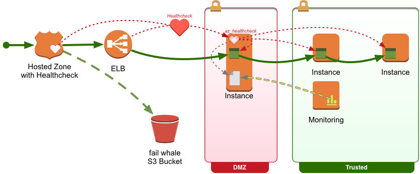

# az_healthcheck


## Summary

* Monitors all endpoints in an AZ to provide an end-to-end healthcheck status.
* Provides an HTTP webservice that can be consumed by an ELB or Route53 healthcheck.
* Writes a healthcheck status file on the local filesystem that can be consumed by monitoring software.




## Configuration

* Configuration is done using a simple **YAML** file called **az_healthcheck.yaml**
* **az_healthcheck** will look for the configuration file in **/etc/az_healthcheck.yaml** or **$(pwd)/az_healthcheck.yaml**


**FILE**: az_healthcheck.yaml

```yaml
---
allowed_failed_checks: 0
options:
  status_file_name: '/var/run/az_health_check.status'

httpchecks:
  identme:
    url: "http://ident.me/"
    headers:
      "X-Browser-Agent": "Mozilla/5.0 (Macintosh; Intel Mac OS X 10_12_1) AppleWebKit/537.36 (KHTML, like Gecko) Chrome/56.0.2924.87 Safari/537.36"

  slashdot:
    url: "https://www.slashdot.org/"


```


## Run with Supervisor


```bash

apt-get install -y supervisor


cat << EOF > /etc/supervisor/supervisord.conf
[unix_http_server]
file=/var/run/supervisor.sock
chmod=0700

[supervisord]
logfile=/var/log/supervisor/supervisord.log
pidfile=/var/run/supervisord.pid
childlogdir=/var/log/supervisor
nodaemon=false

[rpcinterface:supervisor]
supervisor.rpcinterface_factory = supervisor.rpcinterface:make_main_rpcinterface

[supervisorctl]
serverurl=unix:///var/run/supervisor.sock

[include]
files = /etc/supervisor/conf.d/*.conf
EOF


cat << EOF > /etc/supervisor/conf.d/az_healthcheck.conf
[program:az_healthcheck]
command        = /usr/local/bin/az_healthcheck
startsecs      = 5
stopwaitsecs   = 3600
stopasgroup    = false
killasgroup    = true
stdout_logfile = /var/log/az_healthcheck-stdout.log
stderr_logfile = /var/log/az_healthcheck-stderr.log
EOF


service supervisor restart


```

